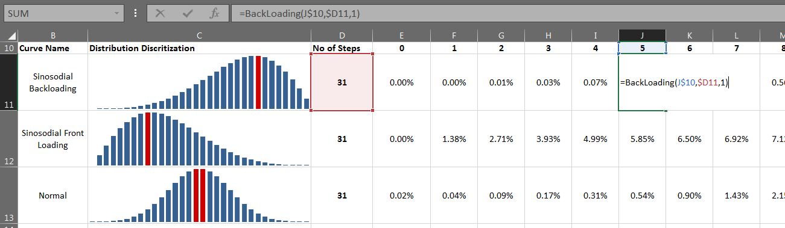

# Distribution_Curve_Sergemntation_with_sum_100percnt
Excel VBA Macro for Segmenting Distribution curve so that sum up with 100%. This can be helpful in planning package for resource loading.

## Distribution Curve covered
1. Centric Normal Distribution
2. Sinosodial Back Loading
3. Sinosodial Front Loading

## Usage

***= Loading_Function (Step, Total_Step, Degree)***

**Degree** 

in Sinosodial Loading, Degree > 1, {1 towards End & higher value drags curve towards center}

in Normal Loading, Degree > 0, {higher value slims the curve}
